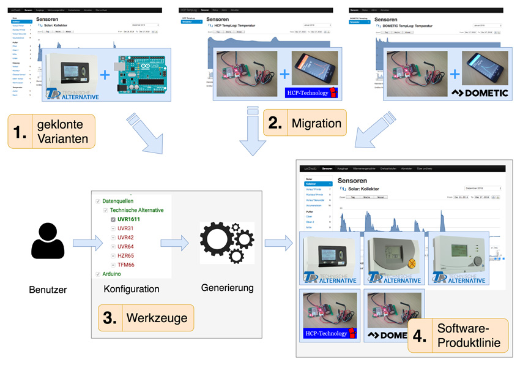

## uvr2web-spl

**uvr2web ist ein Programm zur Überwachung deiner Heizungsregelung.**

Es kann Temperaturdaten visualisieren, diese auf deinem PC oder Smartphone
darstellen und vieles mehr.

**tl;dr: Dieses Repository ist vermutlich nicht, wonach du suchst. Wenn du deine
UVR-Regelung von Technische Alternative überwachen möchtest, besuche
[uvr2web.de](http://uvr2web.de).**

***Aber was ist das hier?***

uvr2web begann 2013 als Hobby-Projekt zum Überwachen meiner UVR1611-Regelung.
Über die Jahre hinweg hat sich der Code verselbständigt, und eine neue
Organisationsstruktur hat sich als sinnvoll erwiesen - und zwar eine sogenannte
*Software-Produktlinie*.

Eine Software-Produktlinie dient dazu, Software zu verwalten, die
unterschiedliche Ausführungen erlaubt. So auch uvr2web: Du kannst verschiedene
Einstellungen am Arduino-Sketch tätigen, unterschiedliche Regelungen verwenden,
die Server-Applikation wechseln und zum Beispiel die API ein- und ausschalten.
Für einen Einstieg in Software-Produktlinien, [klicke
hier](http://www.elias-kuiter.de/sonstiges/produktlinien/).

Das folgende Bild beschreibt unser grundsätzliches Vorgehen zum Extrahieren der
Produktlinie. Details dazu findest du im
[Paper](http://elias-kuiter.de/splc18-uvr2web).

Dieses Repository dient als Ablageort für alles, was nötig ist, um sich eine
maßgeschneiderte Variante von uvr2web zu bauen - es enthält selbst aber keine
fertige Version von uvr2web. Es ist sozusagen nur der Bauplan für die Webseite
[uvr2web.de](http://uvr2web.de).

Falls du an uvr2web mitarbeiten möchtest (z.B. einen Issue oder Pull Request
einreichen), ist das hier der richtige Ort. Der Code für die einzelnen
Funktionalitäten von uvr2web (im Fachjargon *Features* oder *Artefakte*)
befindet sich im Ordner `spl/artifacts`. Von besonderem Interesse sind dabei die
Features `arduino` und `database`, die den Basiscode von uvr2web beinhalten.

***Wie funktioniert das?***

[uvr2web.de](http://uvr2web.de) verwendet Tools zur Verwaltung von
Software-Produktlinien, die ich extra für diesen Zweck entwickelt habe,
insbesondere [ekuiter/feature-php](https://github.com/ekuiter/feature-php) und
[ekuiter/feature-web](https://github.com/ekuiter/feature-web).

Diese Tools stellen eine Oberfläche zum Konfigurieren und automatischen
Generieren einer Software-Variante bereit, sind aber auch mit beliebigen anderen
Produktlinien kompatibel. Benutze die Links oben, um mehr über die Tools zu
erfahren.

Falls du dich einfach nur etwas in den Code von uvr2web einlesen möchtest, ist
es am einfachsten, wenn du auf [uvr2web.de](http://uvr2web.de) eine Variante
herunterlädst und dir diese genauer anschaust.

Das Changelog für die Produktlinie findest du in den Commit Messages bzw. Tags.
Dort findest du auch Informationen zu *breaking changes* und Kompatibilität.

### Software Product Line Case Study

This repository contains software artifacts mentioned in our SPLC'18 paper
[Getting Rid of Clone-And-Own: Moving to a Software Product Line for Temperature
Monitoring](http://elias-kuiter.de/splc18-uvr2web).

It contains the feature model and implementation details for the *uvr2web*
software product line (after the extraction process). For accessing the
artifacts before extraction, refer to [the original uvr2web
repository](https://github.com/ekuiter/uvr2web).

In the `spl/artifacts` directory, we provide implementation details for most
features of the software product line. The feature model is available at
`spl/model.xml`.

Other repositories related to the paper are:
[feature-model-viz](https://github.com/ekuiter/feature-model-viz),
[feature-configurator](https://github.com/ekuiter/feature-configurator),
[feature-php](https://github.com/ekuiter/feature-php) and
[feature-web](https://github.com/ekuiter/feature-web).
